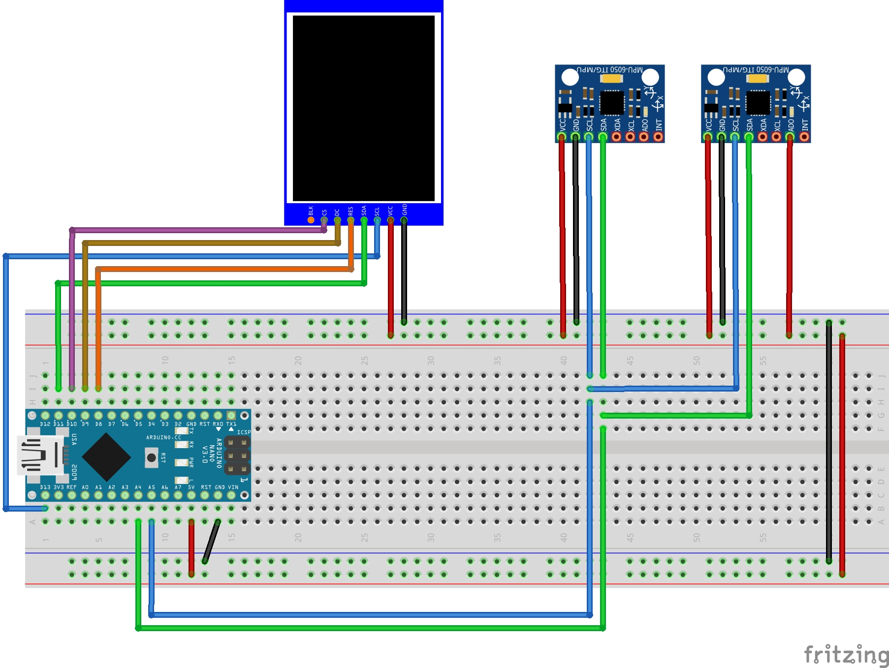

# Pong-2-Player-Gyro
 Pong Game - Arduino - 2 Player - Gyros

## Purpose

Arduino based Pong Game for 2 players. The paddles are controlled with gyro sensors. 

## Part list

- Arduino Nano (Uno works as well with same pins, other microcontrollers would work as well but you have to figure out the pins)
- 2x Gyro sensors GY-521
- TFT 1.44" with ST7735S controller
- 2x push buttons
- calbles, circuit board, 3D-printed controller / housing

## Pins

|TFT 1.44"|Arduino Nano|
|-|-|
   GND|GND  
   VCC|5V  
   SCL|D13  
   SDA|D11  
   RES|D8  
   DC|D9  
   CS|D10  

|GY-521|Arduino Nano|
|-|-|
   Vcc|5V  
   GND|GND  
   SCL|A5  
   SDA|A4  
   AD0|5V (only one of the sensors)  
  
Thats the same for both GY-521, howwever, **one of them needs to connect the AD0 pin to 5V**. This will change the I2C address so the two gyros have a different address.  

**Attention**: The TFT 1.44" display exists in different variations, different pinouts and electronics. Some have a voltage step down module integrated, some not, it seems as if therefore some need to work with 3.3V instead of 5V.   
Mine doesnt't have a step down module, I still tried it with 5V and I didn't fry it;) But you should be aware of the risk. (The Arduino Nano logic is 5V)

# Breadboard layout

# Non standard Arduino libraries

[Adafruit_ST7735](https://github.com/adafruit/Adafruit-ST7735-Library)  
[MPU6050_light](https://github.com/rfetick/MPU6050_light)  
Both can be installed via the arduino library manager  

# 3D-Printing Files
- Controllers, basically only holders for the gyros. [Link](https://cad.onshape.com/documents/e8f608abf657cef6dc1b4666/w/007233a8e505381b6e8c31cd/e/1e409a07bb671ca26936d715)  
  --> STLs can be found in the STL folder
- Case (needs to be done)
 
